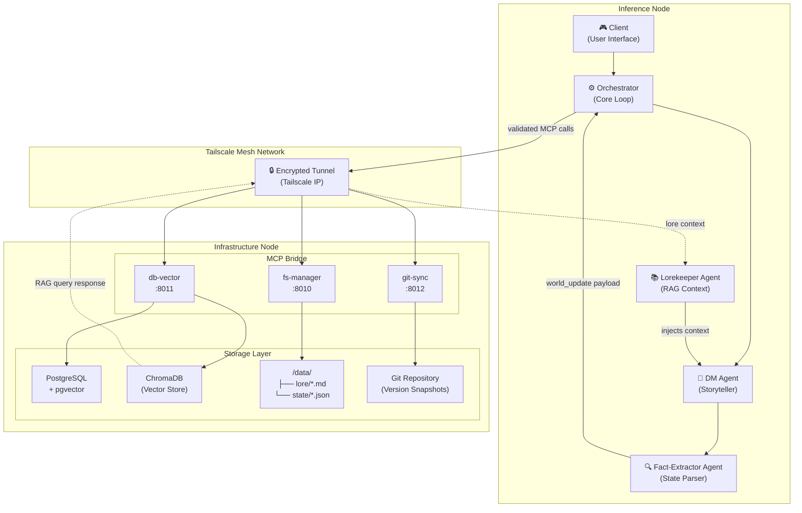
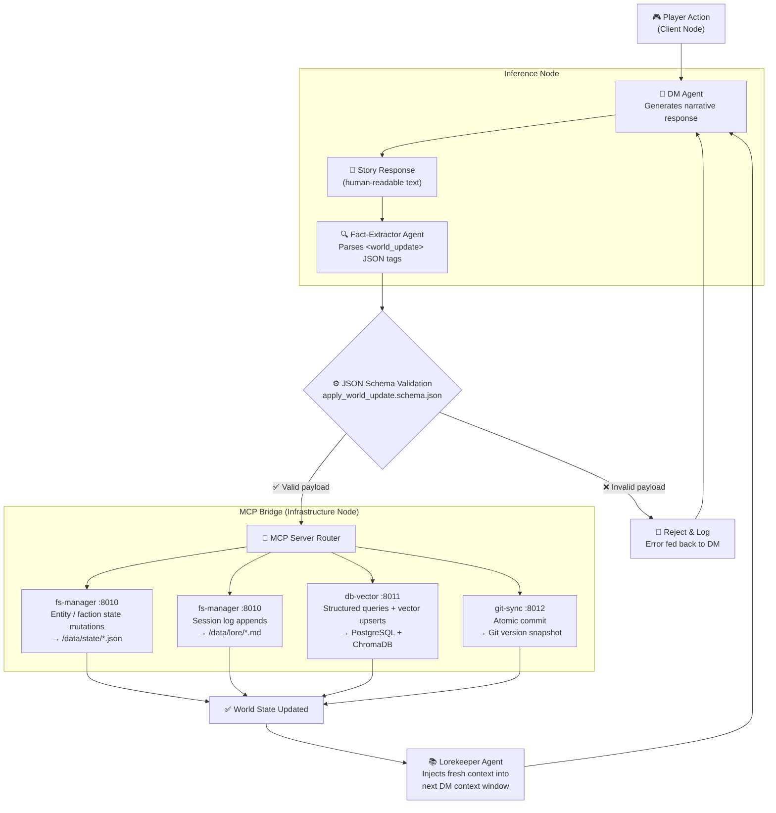
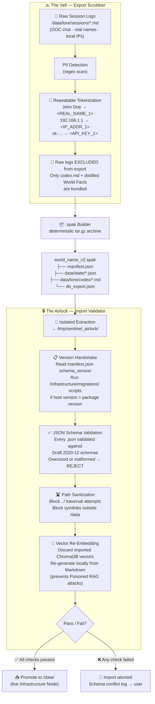

# Project Sentinel — Architecture Reference

## The Core vs. Community Framework

Sentinel is designed to ingest community content without ever risking corruption of the primary world state. This document defines the exact rules that govern how Core and Community content coexist.

---

## 1. Namespace Separation

All content in Sentinel — whether lore, state, or code — must declare its origin namespace explicitly. This allows the engine to resolve conflicts, prioritize retrieval, and audit contributions without ambiguity.

### Filesystem Namespace

```text
data/
├── lore/
│   ├── core/              # Canonical world truth — maintained by Core team only
│   │   ├── codex/         # World history, cosmology, primary factions
│   │   └── sessions/      # Official session transcripts
│   └── community/         # Community contributions — segregated per author
│       └── <author-handle>/
│           ├── codex/
│           └── npcs/
└── state/
    ├── core/              # Primary world state — only writable by Core MCP servers
    │   ├── entities/
    │   └── factions/
    └── community/         # Community-contributed state extensions
        └── <pack-name>/
```

### RAG Index Namespace

All documents ingested into ChromaDB must be tagged with their namespace at the metadata level:

```json
{
  "id": "doc_trog_history_001",
  "namespace": "core",
  "source_file": "data/lore/core/codex/trog.md",
  "author": "sentinel-core",
  "priority": 10
}
```

Community documents use `"namespace": "community"` and a lower `priority` integer (1-9). When the Lorekeeper agent queries ChromaDB for context, results are sorted by `priority` descending before being injected into the DM's context window. Core facts always surface first.

---

## 2. The Override Hierarchy

If a community contribution contradicts an established Core fact, **Core Lore always wins**.

### Resolution Order

```
1. Core State    (data/state/core/)          — Highest authority. Read-only for community.
2. Core Lore     (data/lore/core/)           — Canonical narrative truth.
3. Community State (data/state/community/)   — Additive only. Cannot overwrite core fields.
4. Community Lore  (data/lore/community/)    — Contextual supplements. Lower RAG priority.
```

### Enforcement Mechanism

The `fs-manager` MCP server enforces this at write time. When processing an `apply_world_update` payload:

1. It checks `target_file` against the path regex: writes to `data/state/core/` or `data/lore/core/` are **blocked** unless the request carries a `"namespace": "core"` authorization token.
2. Community writes are restricted to `data/state/community/<pack-name>/` and `data/lore/community/<author>/`.
3. Core entity `unique_id` fields cannot be modified by any community payload (see Protected Fields below).

### Example: Conflicting NPC Location

- **Core Lore** (`data/lore/core/codex/trog.md`) states: *"Trog resides permanently in the Sunken Citadel."*
- **Community Lore** (`data/lore/community/bard-pack/npcs/trog.md`) states: *"Trog was last seen wandering the Northern Wastes."*

When the Lorekeeper queries ChromaDB for context about Trog, the Core document surfaces first (higher priority). The DM is instructed: *"If Community lore contradicts Core lore, treat Core lore as ground truth. Treat Community additions as rumors, legends, or alternative perspectives — not facts."*

---

## 3. The Community Gateway: `community.json`

Every community content pack must include a `community.json` manifest at its root. This file is the single declaration that tells the engine:
- What new content is being added
- What core entities it references (but does not modify)
- What it is explicitly *not* allowed to touch

The `fs-manager` reads this manifest on pack initialization and registers the content in both the ChromaDB index and the PostgreSQL metadata table.

### `community.json` Schema

```json
{
  "$schema": "https://json-schema.org/draft/2020-12/schema",
  "$id": "https://sentinel.local/schemas/community_manifest.json",
  "title": "Community Content Pack Manifest",
  "type": "object",
  "properties": {
    "pack_id": {
      "type": "string",
      "pattern": "^[a-z0-9-]{3,32}$",
      "description": "Unique, kebab-case identifier for this content pack."
    },
    "author": {
      "type": "string",
      "description": "GitHub handle or org name of the contributor."
    },
    "version": {
      "type": "string",
      "pattern": "^\\d+\\.\\d+\\.\\d+$"
    },
    "description": {
      "type": "string",
      "maxLength": 500
    },
    "adds": {
      "type": "object",
      "description": "Declarations of net-new content this pack introduces.",
      "properties": {
        "locations": {
          "type": "array",
          "items": { "type": "string" },
          "description": "Names of new locations added by this pack."
        },
        "npcs": {
          "type": "array",
          "items": { "type": "string" },
          "description": "Names of new NPCs added by this pack."
        },
        "items": {
          "type": "array",
          "items": { "type": "string" },
          "description": "Names of new items added by this pack."
        },
        "factions": {
          "type": "array",
          "items": { "type": "string" }
        }
      }
    },
    "references": {
      "type": "array",
      "items": { "type": "string" },
      "description": "Core entity unique_ids this pack references but does NOT modify."
    },
    "lore_files": {
      "type": "array",
      "items": {
        "type": "string",
        "pattern": "^data/lore/community/.+\\.md$"
      },
      "description": "All Markdown lore files included in this pack, for RAG indexing."
    }
  },
  "required": ["pack_id", "author", "version", "description", "adds", "lore_files"],
  "additionalProperties": false
}
```

### Example `community.json`

```json
{
  "pack_id": "northern-wastes-expansion",
  "author": "chronicler-mael",
  "version": "1.0.0",
  "description": "Adds the Northern Wastes region with 3 new locations, 5 NPCs, and a rival faction.",
  "adds": {
    "locations": ["The Ashfields", "Frostpeak Keep", "The Wanderer's Hollow"],
    "npcs": ["Seriva the Scarred", "Old Maren", "The Pale Watcher"],
    "items": ["Ashfield Compass", "Frostpeak Sigil"],
    "factions": ["The Icebound Brotherhood"]
  },
  "references": ["entity_trog_001", "location_sunken_citadel_001"],
  "lore_files": [
    "data/lore/community/chronicler-mael/codex/northern-wastes.md",
    "data/lore/community/chronicler-mael/npcs/seriva.md"
  ]
}
```

---

## 4. Protected Fields

The following properties in Core state JSON schemas are **strictly immutable** by community content. Any `apply_world_update` payload that attempts to modify these fields will be rejected by the `fs-manager` with a `PROTECTED_FIELD_VIOLATION` error code.

| Field | Scope | Reason |
|---|---|---|
| `unique_id` | All entities | Primary key integrity — changing this breaks all cross-references. |
| `world_seed` | World root object | The foundational seed hash that defines canonical world generation. |
| `namespace` | All entities | Namespace ownership cannot be transferred post-creation. |
| `created_at` | All entities | Immutable audit timestamp. |
| `canon` | Lore documents | The `canon: true` flag marks documents as Core truth — only Core team can set this. |
| `core_faction_id` | Factions | Core faction identity cannot be reassigned by community packs. |

### Schema Enforcement Example

In `schemas/entity.schema.json`, protected fields are marked with a custom extension keyword:

```json
{
  "unique_id": {
    "type": "string",
    "format": "uuid",
    "description": "Immutable primary identifier.",
    "x-sentinel-protected": true,
    "readOnly": true
  }
}
```

The `fs-manager` reads `x-sentinel-protected: true` and adds those keys to a blocklist before processing any `update` operation. It does not matter what the Inference Node sends — those keys will never be written.

---

## 5. Node Roles Summary

| Node | Role | Can Write To | Cannot Write To |
|---|---|---|---|
| Inference Node (World Engine) | Generates narrative + `<world_update>` tags | Via MCP servers only | Filesystem directly |
| fs-manager MCP | Executes validated file writes | `data/state/community/`, `data/lore/community/`, `data/lore/core/sessions/` | `data/state/core/entities/`, `data/lore/core/codex/` (without core token) |
| db-vector MCP | Reads/writes PostgreSQL + ChromaDB | All DB tables for reads; `community` namespace for writes | Core namespace records |
| git-sync MCP | Commits after each world update | Git history | N/A |
| Core Team | Maintains Core namespace | All directories | N/A |

---

## 6. Architecture Node Graph

How the Inference Node communicates with the Infrastructure Node through the Tailscale mesh and MCP Bridge.



---

## 7. Diagram: The Full Update Pipeline



---

## 8. The Sentinel Porter (Portability Specification)

To enable a collaborative, decentralized multiverse, Project Sentinel supports the complete export and import of diverged world states. The **Sentinel Porter** is the dedicated subsystem that manages this lifecycle, ensuring that sharing a world is seamless, secure, and privacy-respecting.

### The `.spak` Format

A Sentinel world state is exported as a single compressed archive — a **Sentinel Package (`.spak`)** — structured as a deterministic `.tar.gz`:

```
world_name_v2.spak/
├── manifest.json          ← schema_version, pack metadata, author
├── data/
│   ├── state/             ← entity + faction JSON (no .git history)
│   └── lore/
│       └── codex/         ← distilled World Facts only (no raw session logs)
└── db_export.json         ← structured entity records (no ChromaDB vectors)
```

Raw session logs (`data/lore/core/sessions/`) are **never included** — they contain PII. Vector embeddings are **never included** — they are re-generated locally to prevent Poisoned RAG attacks.

### The Airlock (Import → Export Lifecycle)


