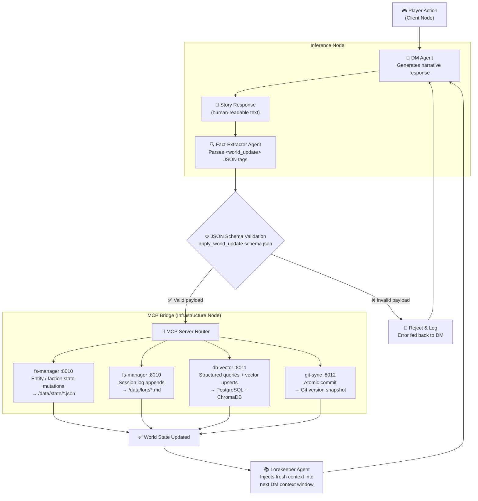

# Project Sentinel

[](https://opensource.org/licenses/MIT)
[](https://www.python.org/downloads/)
[](https://nodejs.org/)
[](CONTRIBUTING.md)
[](https://modelcontextprotocol.io)

**What if your RPG world kept evolving while you slept?**

Project Sentinel is an autonomous world engine that keeps a living, breathing RPG universe running without a human dungeon master at the wheel. Every player action flows through an LLM storytelling agent, gets parsed for world-state changes by a Fact-Extractor, and is committed to a Git-backed infrastructure — automatically, atomically, and without touching a single file by hand.

The secret: the Inference Node is **never granted direct filesystem access**. All world mutations route through local MCP servers that validate every write against JSON Schema contracts before anything persists. The result is an AI that can run your campaign for months, maintain narrative consistency across thousands of turns, and never corrupt your world state.

> **The user's only interface is the narrative. The system handles everything else.**

---

## How It Works: Agentic Architecture

Sentinel is built on a pattern called **LLM Orchestration over a Schema-Enforced Infrastructure**. Three specialist agents — a Dungeon Master, a Fact-Extractor, and a Lorekeeper — run as an agentic loop on the Inference Node. They talk to each other through structured prompts, not function calls.

The Inference Node never touches files. When the DM generates a story beat that changes the world, the Fact-Extractor agent parses the response and emits a structured `<world_update>` JSON payload. That payload travels across the MCP Bridge to the Infrastructure Node, where it is validated against a Draft 2020-12 JSON Schema before a single byte is written to disk.

This is **Prompt-Driven Development** at the infrastructure level: the narrative is the API, the schema is the contract, and the MCP server is the enforcer. Contributors can literally describe a new game mechanic in natural language to their LLM of choice, and if the generated MCP server adheres to the schema contract, the engine picks it up automatically — Zero-Touch File I/O by design.

---

## Architecture Skeleton

Sentinel operates on a strict separation of concerns to enable seamless remote play via a Tailscale mesh network.

1. **Inference Node** (`/world-engine`): Houses the DM, Fact-Extractor, and Lorekeeper agents. It evaluates user input, queries the world state, and outputs rich narrative alongside machine-readable `<world_update>` tags.
2. **Infrastructure Node** (`/infrastructure`): The persistent storage layer. It manages the PostgreSQL/Vector database, background simulations, and a Git-backed hybrid filesystem (JSON for state, Markdown for lore).
3. **The MCP Bridge** (`/mcp-servers`): The Inference Node *never* touches files directly. It issues structured requests to local MCP servers on the Infrastructure Node, which validate and execute filesystem, database, and git operations.

```text
project-sentinel/
├── data/                      # Hybrid Storage Layer
│   ├── lore/                  # Human-readable narrative (Markdown)
│   │   ├── codex/             # World building, locations, histories
│   │   └── sessions/          # Play session transcripts and logs
│   └── state/                 # Machine-readable current world state (JSON)
│       ├── entities/          # NPCs, players, and items
│       └── factions/          # Faction standings and resources
├── infrastructure/            # Node Backbone (The Brawn)
│   ├── docker/                # Compose files for PostgreSQL & pgvector
│   ├── migrations/            # SQL scripts for DB schema initialization
│   └── tailscale/             # Mesh network configurations and ACLs
├── mcp-servers/               # The Bridge (Model Context Protocol)
│   ├── db-vector/             # RAG/DB interface (query routing, vector search)
│   ├── fs-manager/            # Zero-Touch file handler for /data CRUD
│   └── git-sync/              # Automated version control and state snapshotting
├── schemas/                   # Shared JSON Schema contracts
│   └── apply_world_update.schema.json
├── world-engine/              # Inference & Orchestration (The Brain)
│   ├── agents/                # Prompt boundaries and persona definitions
│   │   ├── dm.yaml            # Storyteller and rule arbiter
│   │   ├── fact-extractor.yaml# Parses narrative into <world_update> events
│   │   └── lorekeeper.yaml    # Manages RAG context injection
│   ├── orchestrator/          # The Core Loop (Action -> Narrative -> Extract -> Update)
│   └── simulation/            # Background world progression and cron-events
├── .github/
│   └── ISSUE_TEMPLATE/        # Contributor templates (Lore-Smith, Technician, Architect)
├── ARCHITECTURE.md            # Core vs. Community framework and namespace rules
├── CONTRIBUTING.md            # Contributor pathways and coding standards
├── folder_structure.json      # Machine-readable repo manifest
└── README.md
```

---

## The Core Loop



1. **Action**: User inputs a role-play action via the Client Node.
2. **Narrative**: DM Agent generates the story response.
3. **Extraction**: Fact-Extractor parses the response for state changes.
4. **Trigger**: System generates a structured `<world_update>` JSON payload.
5. **Execution**: Relevant MCP server (Filesystem/DB) consumes the payload and updates the Infrastructure.
6. **Sync**: Git-Sync MCP commits the change to version control.
7. **Reload**: Updated world state is injected into the next DM context window.

---

## Getting Started (Bridge Initialization)

### Prerequisites

- Docker and Docker Compose
- Python 3.11+
- Tailscale (for multi-node deployments)
- A Tailscale account with both nodes authenticated

### 1. Configure Environment

```bash
cp infrastructure/.env.example infrastructure/.env
# Edit .env with your credentials and Tailscale IP
```

### 2. Spin Up the Infrastructure Node

```bash
cd infrastructure
docker-compose up -d

# Verify both services are healthy
docker-compose ps
```

### 3. Start the MCP Bridge

```bash
# Filesystem manager — handles /data CRUD with schema validation
python -m mcp_servers.fs_manager --port 8000

# Vector DB interface — routes queries to PostgreSQL and ChromaDB
python -m mcp_servers.db_vector --port 8001

# Git sync — automated versioning after each world update
python -m mcp_servers.git_sync --port 8002
```

### 4. Initialize the Inference Loop

```bash
cd world-engine
python orchestrator/main.py
```

---

## Core Principles

- **Automation First** — The world updates itself. Zero manual file handling.
- **Modularity Always** — Every subsystem is independently replaceable.
- **Human-Readable** — Lore stored in Markdown; state stored in JSON.
- **AI-Native** — Personas, pipelines, and tools designed for LLM orchestration.
- **Schema-Enforced** — The Inference Node is *never* granted raw filesystem access.
- **Community-Friendly** — Plug-and-play via the `community.json` gateway manifest.

---

## Live Demo

A fully functional reference implementation of Project Sentinel (React frontend + Express backend + PostgreSQL) is available at the repository root. See the `artifacts/` directory.

---

## Built By the Hive

Project Sentinel v0.1 was vibe-coded and architected through a coalition of AI tools. We think that's worth celebrating.

| Contributor | Role in Genesis |
|---|---|
| **Google Gemini** (AI Studio) | System architecture, schema design, and the Sentinel Porter / Airlock specification |
| **Anthropic Claude** | CONTRIBUTING guidelines, security policy, and MCP server hardening |
| **OpenAI** | DM persona prompts, Fact-Extractor agent definitions, and the `gpt-5-mini` reference implementation |
| **Replit** | Full-stack scaffolding, live development environment, and the React + Express artifact |
| **GitHub Copilot** | Inline completions, test generation, and TypeScript library boilerplate |

In 2026, the best open-source projects are human-directed and AI-synthesized. Sentinel is proof of concept. The humans set the vision, held the architecture accountable, and enforced the schema contracts. The AI did the heavy lifting.

**You are welcome to do the same.** See [The Vibe Coder's Guide](CONTRIBUTING.md#4-the-vibe-coders-guide) in CONTRIBUTING.md.

---

## License

MIT — Build worlds. Share them.
